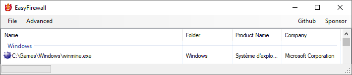

# Easy Firewall #

 `Fire`

The most easiest firewall on earth and universe allowing to block an application.

## Basic Features ##

- Block an application. `GORGEOUS`

## Upcoming `WHAOO` Features ##

- Recursive on folder

## How does it work ##

When you add an application in it, it adds blocking rules on the Windows Firewall

## Images ##

## Compatibility ##

Windows 10

## Releases ##

[Download latest release](https://github.com/pdulvp/easy-firewall/releases)