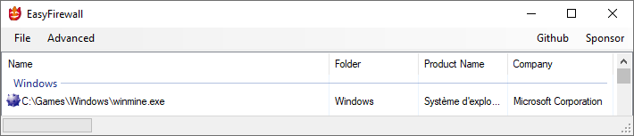

# Easy Firewall 日本語版 #

 `Fire`

このアプリケーションは、シンプルなUIで簡単にWindowsファイアウォールのルール追加とアプリケーションのブロックを可能にします。

すべてのプロファイル(プライベート、パブリック) 
任意のポートや任意のプロトコル、任意の方向をブロックできます。

## 基本的な機能 ##

- アプリケーションのブロック
- アプリケーションのブロックを解除

## 使用方法 ##

操作は非常に簡単です。 
アプリケーションのブロックを有効にするには、EasyFirewallを起動し「ファイル」->「新規でアプリケーションをブロック」のメニューからブロックを行なうアプリケーションを指定するだけです。 
ブロックの解除は、リスト上の項目を削除する事で解除されます。

## 互換性 ##

Windows 10/11で動作を確認済みです。 
前のバージョンや次のバージョンでも動作する可能性があります。

## 必要事項 ##

Windowsファイアウォールが有効化されている事が必須です。

## リリース ##

[最新版のダウンロードはこちらです。](https://github.com/reindex-ot/easy-firewall-jp/releases)
